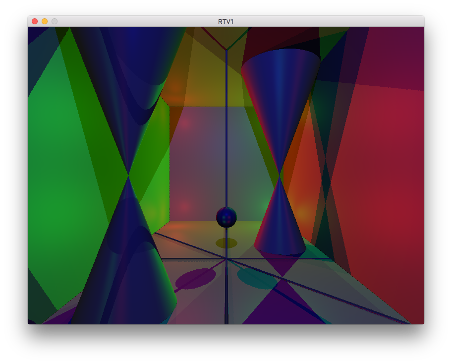
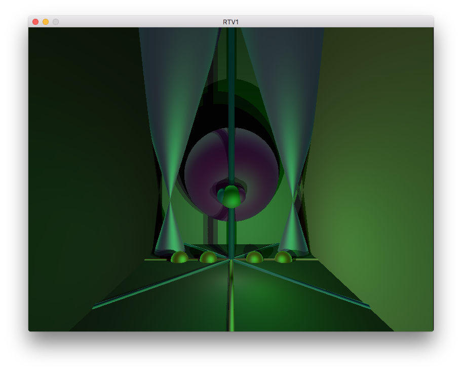
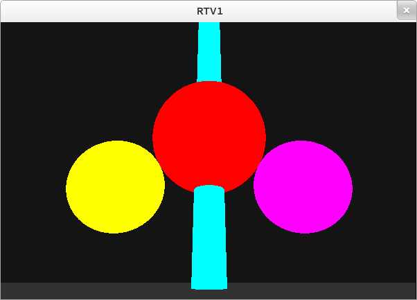

# Raytracer #

Raytracer engine

#### The engine is built using a custom X11 wrapper implemented at [Ecole 42](https://www.42.fr)

You can't run it, I will update the code and the readme to make it easier to run

####  Step 3 (basic) ####
<HTML>
   
</HTML>

####  Step 2 (basic) ####
<HTML>
      
</HTML>

####  Step 1 (basic) ####
<HTML>
      
</HTML>
